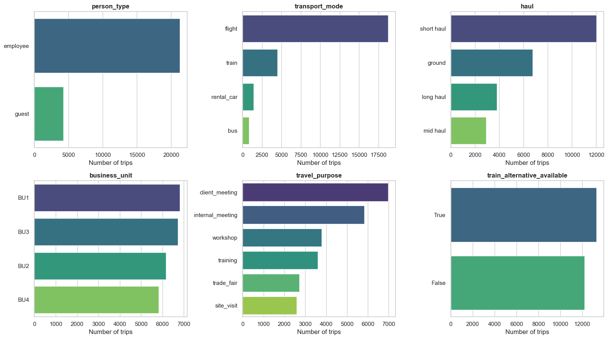
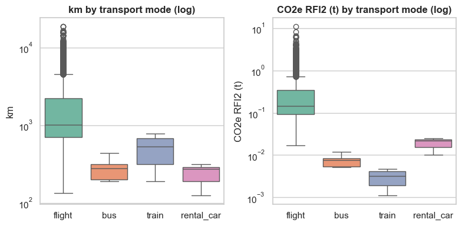
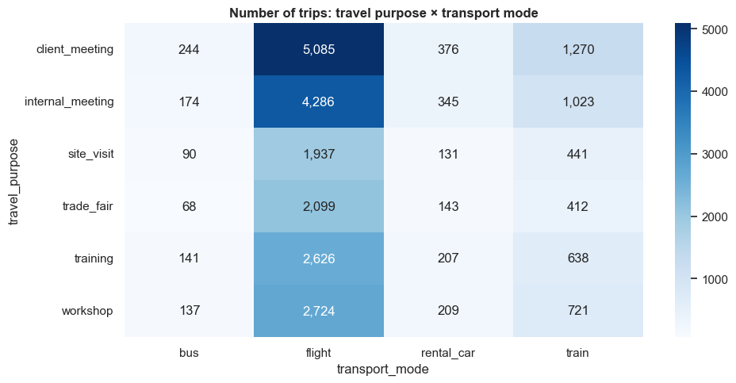
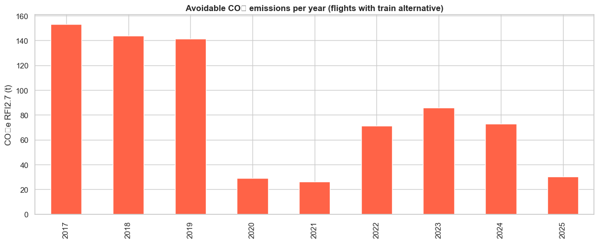
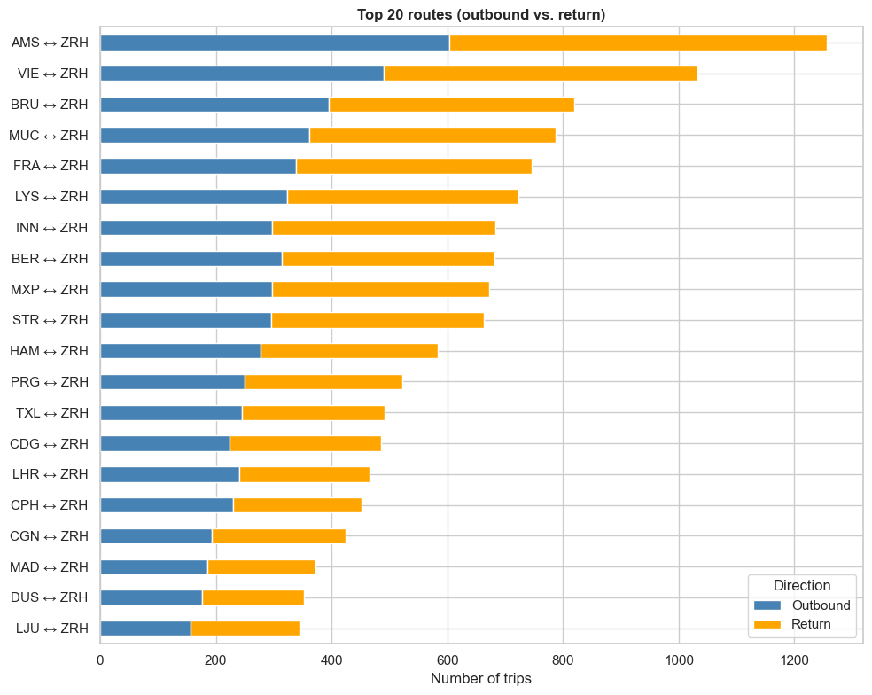
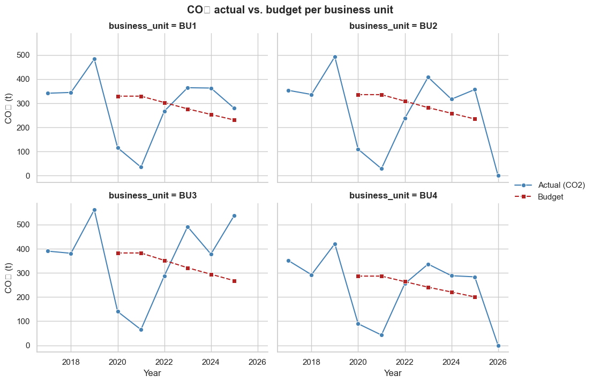

# Data Report

This data report documents all data used in the **Carbon Gatekeeper Dashboard** project. It covers the identification and acquisition of relevant data sources and the exploratory data analysis (EDA) performed to understand data quality and structure. Together, these two parts cover the *Data Acquisition and Exploration* phase of the project.

The report ensures **traceability and reproducibility** of the results — in particular, how the historical travel records were prepared, how the CO₂ budgets for 2026 were derived, and how planned trips are merged with the historical reference data to calculate emissions and modal-shift potentials in the dashboard.

> **Data pipeline at a glance**
>
> `traveldata-export.xlsx` (raw export)
>     → manual cleaning in Excel + CO₂-budget assumption for 2026
>     → `traveldata-export_clean.xlsx` (historical reference loaded into the app)
>     → `input_data.xlsx` (planned trips, used to test the dashboard)

---

---

## Raw Data

### Overview Raw Datasets

| Name                      | Source                                              | Storage Location                                |
| ------------------------- | --------------------------------------------------- | ----------------------------------------------- |
| Travel Data Export (raw)  | Company travel management system (~25,500 records) | `traveldata-export.xlsx`                         |
| Planned Trips Input       | User-provided operational travel plans              | `input_data.xlsx` (uploaded via Streamlit sidebar) |

### Details Dataset 1: Historical Reference Data

- **Description:** Original export from the corporate travel management system. Contains **25,527 business-trip segments** over the period **2017-01-01 to 2026-01-05** for four transport modes (flight, train, bus, rental car). Each row represents one trip segment with full geographic information, CO₂ figures calculated under two Radiative Forcing Index (RFI) assumptions, costs in CHF and an organisational mapping (business unit / subunit).
- **Data Source:** Internal travel and sustainability department.
- **Data Governance:** Internal business use. No personally identifiable information is stored.
- **File Format:** Excel workbook with three sheets: `travel_data` (25,527 × 27), `data_dictionary` (27 × 3) and `co2_budgets` (100 × 3).

#### Data Catalogue — `travel_data` Sheet

| #  | Column Name                   | Datatype | Values / Range                                            | Short Description                                                                          |
| -- | ----------------------------- | -------- | --------------------------------------------------------- | ------------------------------------------------------------------------------------------ |
| 1  | `person_type`                 | text     | `employee`, `guest`                                       | Employee or external guest travelling on behalf of the company.                            |
| 2  | `date`                        | date     | 2017-01-01 … 2026-01-05                                   | Date of the trip segment.                                                                  |
| 3  | `transport_mode`              | text     | `flight`, `train`, `bus`, `rental_car`                    | Mode of transport.                                                                         |
| 4  | `departure_iata`              | text     | 3-letter IATA code                                        | Departure airport / city (e.g. `ZRH` = Zurich).                                            |
| 5  | `arrival_iata`                | text     | 3-letter IATA code                                        | Arrival airport / city.                                                                    |
| 6  | `travel_class`                | text     | Flights: `Y`/`B`/`P`; trains: `standard`/`first`          | Booking class.                                                                             |
| 7  | `flight_number`               | text     | e.g. `LX340`; `NaN` for ground transport                  | Airline code + number.                                                                     |
| 8  | `CO2e RFI2 (t)`               | number   | ≥ 0                                                       | CO₂-equivalent emissions in tonnes using a Radiative Forcing Index of 2.                   |
| 9  | `CO2e RFI2.7 (t)`             | number   | ≥ 0                                                       | CO₂-equivalent emissions using RFI 2.7 (non-CO₂ altitude effects); equals RFI2 for ground. |
| 10 | `km`                          | number   | > 0                                                       | Great-circle distance in kilometres.                                                       |
| 11 | `haul`                        | text     | `short haul`, `mid haul`, `long haul`, `ground`           | Distance category (short < ~1500 km; ground = train/bus/car).                              |
| 12 | `departure_city`              | text     | —                                                         | Departure city name.                                                                       |
| 13 | `departure_country`           | text     | ISO 2-letter                                              | Departure country.                                                                         |
| 14 | `departure_continent`         | text     | `EU`, `AS`, `NA`, …                                       | Departure continent.                                                                       |
| 15 | `departure_lat`               | number   | -90 … 90                                                  | Departure latitude (WGS 84).                                                               |
| 16 | `departure_lon`               | number   | -180 … 180                                                | Departure longitude (WGS 84).                                                              |
| 17 | `arrival_city`                | text     | —                                                         | Arrival city name.                                                                         |
| 18 | `arrival_country`             | text     | ISO 2-letter                                              | Arrival country.                                                                           |
| 19 | `arrival_continent`           | text     | —                                                         | Arrival continent.                                                                         |
| 20 | `arrival_lat`                 | number   | -90 … 90                                                  | Arrival latitude (WGS 84).                                                                 |
| 21 | `arrival_lon`                 | number   | -180 … 180                                                | Arrival longitude (WGS 84).                                                                |
| 22 | `aircraft_type`               | text     | e.g. `Airbus A320`; `NaN` for ground transport            | Aircraft model (flights only).                                                             |
| 23 | `business_unit`               | text     | `BU1`, `BU2`, `BU3`, `BU4`                                | Organisational business unit.                                                              |
| 24 | `subunit`                     | text     | `Subunit 1.1`, `Subunit 1.2`, … `Subunit 4.2` (10 levels) | Organisational subunit within the BU.                                                      |
| 25 | `travel_purpose`              | text     | 6 categories (see below)                                  | Purpose of the trip.                                                                       |
| 26 | `cost_CHF`                    | number   | > 0                                                       | Trip cost in Swiss francs.                                                                 |
| 27 | `train_alternative_available` | boolean  | `True` / `False`                                          | `True` if a realistic train connection exists (< 800 km, both ends in Europe).            |

Travel purposes: `client_meeting`, `internal_meeting`, `workshop`, `trade_fair`, `site_visit`, `training`.

#### Data Catalogue — `co2_budgets` Sheet (raw)

| # | Column Name    | Datatype | Values / Range                | Short Description                              |
| - | -------------- | -------- | ----------------------------- | ---------------------------------------------- |
| 1 | `subunit`      | text     | `Subunit 1.1` … `Subunit 4.2` | Organisational subunit (10 distinct values).   |
| 2 | `year`         | integer  | 2017 … 2026                   | Reporting year.                                |
| 3 | `co2_budget_t` | number   | ≥ 0 or `NaN`                  | Allocated CO₂ budget in tonnes for that year.  |

Note that the raw `co2_budgets` sheet provides values only for **2020–2025** (`NaN` for 2017–2019 and for **2026**). The 2026 figures are derived during the data preparation step (see Section "Data Preparation & Cleaning" below).

### Details Dataset 2: Planned Trips Input

- **Description:** A dynamic list of planned, upcoming trips provided by the travel or sustainability manager and uploaded into the Streamlit dashboard. Used to estimate future emissions against the 2026 budget and to identify modal-shift potential.
- **File Format:** Excel workbook with two sheets: `planned_trips` (the trip list) and `instructions`.
- **Required columns:** `business_unit`, `transport_mode`, `departure_iata`, `arrival_iata`. Optional: `date`, `person_type`, `travel_purpose`, `cost_CHF`. Coordinates, kilometres and CO₂ are **not** required, they are enriched on the fly by the dashboard from the historical reference.

#### Data Catalogue — `planned_trips` Sheet

| # | Column Name      | Datatype | Required? | Allowed values                                                                                                            |
| - | ---------------- | -------- | --------- | ------------------------------------------------------------------------------------------------------------------------- |
| 1 | `date`           | date     | optional  | `YYYY-MM-DD` — helps with time filters                                                                                    |
| 2 | `business_unit`  | text     | required  | `BU1`, `BU2`, `BU3`, `BU4`                                                                                                |
| 3 | `person_type`    | text     | optional  | `employee`, `guest`                                                                                                       |
| 4 | `transport_mode` | text     | required  | `flight`, `train`, `bus`, `rental_car`                                                                                    |
| 5 | `departure_iata` | text     | required  | IATA code                                                                                                                 |
| 6 | `arrival_iata`   | text     | required  | IATA code                                                                                                                 |
| 7 | `travel_purpose` | text     | optional  | `client_meeting`, `internal_meeting`, `site_visit`, `trade_fair`, `training`, `workshop`                                  |
| 8 | `cost_CHF`       | number   | optional  | Planned travel cost in CHF                                                                                                |

---

## Data Preparation & Cleaning

The raw export `traveldata-export.xlsx` was processed **manually in Microsoft Excel** to produce `traveldata-export_clean.xlsx`. The cleaning step did **not** change any trip records, the cleaned `travel_data` sheet has the same row count (25,527) as the raw export.

### Changes applied

1. **Column reduction (27 → 20 columns).** The following eight columns were dropped from `travel_data` because the dashboard does not use them:
   `travel_class`, `flight_number`, `departure_city`, `departure_continent`, `arrival_city`, `arrival_continent`, `aircraft_type`, `subunit`.
2. **New column `budget_2026` added to `travel_data`.** The 2026 CO₂ budget of the trip's BU is denormalised onto every trip row to simplify the per-trip budget comparison in the dashboard.
3. **New sheet `budget_2026` added.** A human-readable budget overview table (per BU, columns *2024*, *2025*, *2026 (Prognose)*, plus a total row).
4. **`data_dictionary` updated** to reflect the reduced column set (19 entries instead of 27).

### Assumption: CO₂ budget 2026

The raw `co2_budgets` sheet contains values up to **2025 only**; the 2026 row is empty (`NaN`). To make the dashboard usable for the upcoming planning year, we derived the **2026 budget** ourselves and stored it in the new `budget_2026` sheet:

> **Assumption.** *The CO₂ budget continues the historical reduction trajectory of roughly **−10 % per year** observed between 2020 and 2025. We therefore set the 2026 budget per BU equal to **2025 × 0.9**, rounded to one decimal place.*

The resulting 2026 budgets per Business Unit are:

| Business Unit | 2024 (t) | 2025 (t) | **2026 (Prognose, t)** |
| ------------- | -------- | -------- | ---------------------- |
| BU1           | 253.7    | 230.6    | **207.5**              |
| BU2           | 258.5    | 235.0    | **211.5**              |
| BU3           | 294.5    | 267.7    | **240.9**              |
| BU4           | 220.8    | 200.6    | **181.2**              |
| **Total**     | 1,027.5  | 933.9    | **841.1**              |

These values are the reference used by every gauge, banner and KPI in the dashboard.

### Cleaned reference file: `traveldataexport_clean.xlsx`

| Sheet             | Rows × Cols  | Purpose                                                                |
| ----------------- | ------------ | ---------------------------------------------------------------------- |
| `travel_data`     | 25,527 × 20  | Cleaned historical trips with `budget_2026` denormalised onto each row |
| `data_dictionary` | 19 × 3       | Column descriptions for the cleaned travel data                        |
| `budget_2026`     | 6 × 4        | Per-BU budgets 2024 / 2025 / 2026                                      |

The cleaned `travel_data` sheet contains **no missing values, no duplicate rows, no negative kilometres / CO₂ / costs**, so no further programmatic cleaning was required in the EDA notebook.

---

## Exploratory Data Analysis (EDA)

The exploratory data analysis was carried out in the Jupyter notebook **`eda/eda_travel_data.ipynb`** on the cleaned file `traveldata-export_clean.xlsx`. The goal was to understand structure, distributions and emission drivers of the historical travel data before designing the visualisations.

### Data Quality

| Check                                       | Result                       |
| ------------------------------------------- | ---------------------------- |
| Missing values (`travel_data`)              | 0                            |
| Fully duplicated rows                       | 0                            |
| Negative `km`                               | 0                            |
| Negative `CO2e RFI2 (t)`                    | 0                            |
| Negative `cost_CHF`                         | 0                            |
| Date range                                  | 2017-01-01 → 2026-01-05      |

Summary statistics of the numeric columns:

| Statistic | km          | CO2e RFI2 (t) | CO2e RFI2.7 (t) | cost_CHF   |
| --------- | ----------- | ------------- | --------------- | ---------- |
| count     | 25,527      | 25,527        | 25,527          | 25,527     |
| mean      | 1,904.8     | 0.30          | 0.42            | 740.07     |
| std       | 2,689.9     | 0.52          | 0.76            | 1,233.26   |
| min       | 125         | 0.00          | 0.00            | 17.46      |
| 25 %      | 494         | 0.02          | 0.02            | 214.98     |
| 50 %      | 750         | 0.10          | 0.14            | 434.05     |
| 75 %      | 1,587       | 0.21          | 0.30            | 659.12     |
| max       | 18,803      | 11.07         | 16.52           | 17,273.18  |

### Univariate Analysis — Categorical Variables

Counts of trips by `person_type`, `transport_mode`, `haul`, `business_unit`, `travel_purpose` and `train_alternative_available`:

- **Person type:** employee = 21,285 · guest = 4,242
- **Transport mode:** flight = 18,757 · train = 4,505 · rental_car = 1,411 · bus = 854
- **Haul:** short haul = 12,024 · ground = 6,770 · long haul = 3,804 · mid haul = 2,929
- **Business unit:** BU1 = 6,821 · BU3 = 6,719 · BU2 = 6,164 · BU4 = 5,823
- **Travel purpose:** client_meeting = 6,975 · internal_meeting = 5,828 · workshop = 3,791 · training = 3,612 · trade_fair = 2,722 · site_visit = 2,599

### Univariate Analysis — Numeric Variables

Distance and CO₂ are heavily right-tailed; log-scaled boxplots per transport mode make the differences between flights and ground transport visible.

### Temporal Development

| Year | Trips | CO₂ RFI2.7 (t) |
| ---- | ----- | -------------- |
| 2017 | 3,446 | 1,437.0        |
| 2018 | 3,366 | 1,354.9        |
| 2019 | 3,637 | 1,957.6        |
| 2020 | 820   | 455.1          |
| 2021 | 531   | 172.5          |
| 2022 | 2,396 | 1,047.0        |
| 2023 | 3,610 | 1,600.4        |
| 2024 | 3,713 | 1,346.0        |
| 2025 | 4,005 | 1,457.4        |
| 2026 | 3     | 0.0            |

(2026 only contains the first few January days, hence the very small counts — the full year 2026 is what the dashboard *plans* against, using `input_data.xlsx`.)

### Bivariate / Multivariate Relationships

#### Travel Purpose and Transport Modes

A heatmap of trip counts shows that **flights dominate every purpose** except short internal meetings, where train usage is more visible.

#### CO₂ and cost per Business Unit

#### Flights with an available train alternative ("avoidable" flights)

This is one of the central insights driving the dashboard's modal-shift recommendation.

| Metric                                                  | Value         |
| ------------------------------------------------------- | ------------- |
| Total flights                                           | 18,757        |
| Flights with `train_alternative_available == True`      | 6,530 (34.8 %) |
| Avoidable CO₂ (RFI 2.7, cumulative)                     | 753.5 t       |
| Avoidable cost (cumulative)                             | CHF 2,880,568 |

### Geographic Analysis

Top arrival countries by trip count and by CO₂, plus top routes ("departure → arrival") and top route *pairs* (collapsed by direction):

### CO₂ Budget Comparison (Actual vs. Budget)

For the per-BU budget comparison, the subunit-level budgets in `co2_budgets` are aggregated to BU level via the rule `Subunit X.Y → BUX`, then joined with the actual yearly emissions:

### Initial Findings

- The data set covers **~25,500 trips** over **2017–2026** for four transport modes.
- **Flights** dominate both trip count and CO₂ emissions; **34.8 %** of all flights have a realistic train alternative, accounting for **753.5 t** of avoidable CO₂ — a clear lever for the dashboard.
- The CO₂ distribution is **strongly right-skewed**: a few long-haul flights drive a disproportionate share of emissions.
- BUs differ markedly in travel volume and CO₂ share — combined with the 2026 budget assumption, this directly motivates the gauge / banner / KPI layout of the dashboard.
- Data quality of the cleaned reference is high: no missing values, no duplicates and no negative numeric values.

---

---

## Processed Data (in-memory, generated by the dashboard)

These data structures are not stored on disk — they are computed by `app.py` on every run from the cleaned reference file and the uploaded planned-trips file.

### Overview Processed Datasets

| Name                 | Source                                       | Storage Location              |
| -------------------- | -------------------------------------------- | ----------------------------- |
| `route_averages`     | Generated from cleaned historical reference  | In-memory (pandas DataFrame)  |
| `estimated_original` | Planned trips enriched with `route_averages` | In-memory (exportable via UI) |
| `alts_original`      | Filtered subset of `estimated_original`      | In-memory (exportable via UI) |

### Details Processed Dataset 1: Route Averages (`route_averages`)

- **Description:** Lookup table created by grouping the cleaned historical data by `departure_iata`, `arrival_iata` and `transport_mode`.
- **Processing Steps:** Calculates mean CO₂ (`avg_co2`), mean distance (`avg_km`) and mean cost per route × mode. Also extracts the first available geographic coordinates (`dep_lat`, `dep_lon`, `arr_lat`, `arr_lon`) for mapping.

### Details Processed Dataset 2: Enriched Input (`estimated_original`)

- **Description:** The user-supplied planned trips transformed into a complete analytical set.
- **Processing Steps:**
  1. Left-join the user input with `route_averages` on `(departure_iata, arrival_iata, transport_mode)`.
  2. **Imputation:** if a planned trip lacks a CO₂ value, populate `estimated_co2` using `avg_co2` for that exact route + mode. Missing coordinates are filled the same way.

### Details Processed Dataset 3: Modal-Shift Alternatives (`alts_original`)

- **Description:** Identifies which planned flights could be substituted by a greener mode (train, bus, rental car).
- **Processing Steps:**
  1. Filter `estimated_original` for `transport_mode == 'flight'`.
  2. Join these flights with `route_averages` where the alternative mode is *not* flight.
  3. Keep rows where `alt_co2 < estimated_co2`.
  4. Compute `saving_t` (absolute) and `saving_pct` (relative).
  5. If multiple alternatives exist (e.g. train *and* bus), sort by `saving_t` and keep the single best alternative per original trip.
  6. The resulting set feeds the **"Apply alternatives"** scenario toggle in the dashboard.
