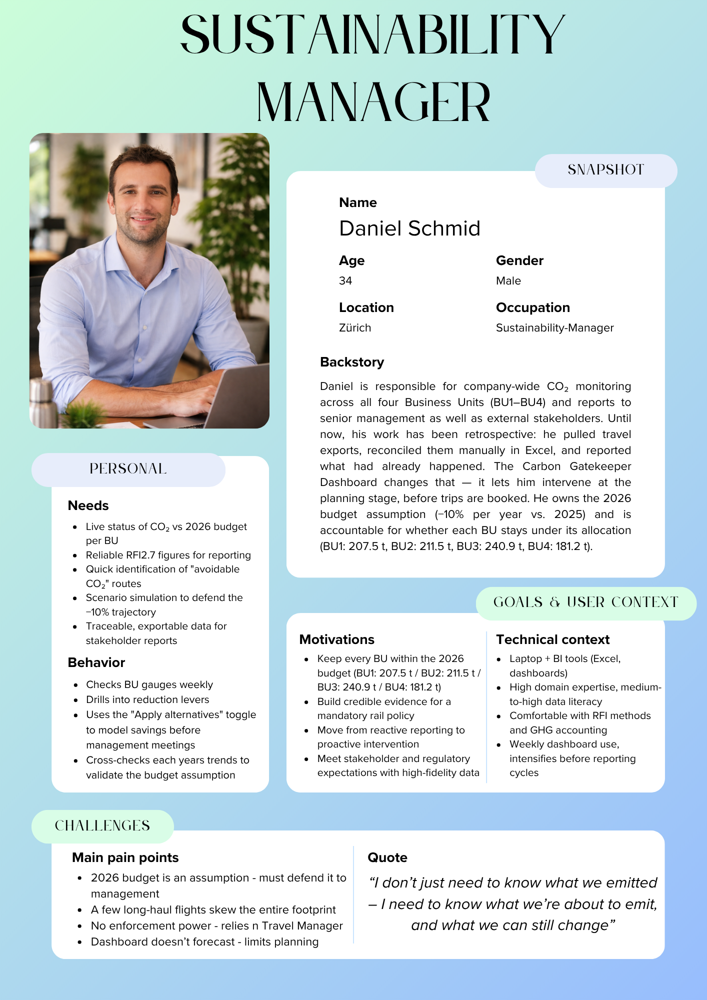
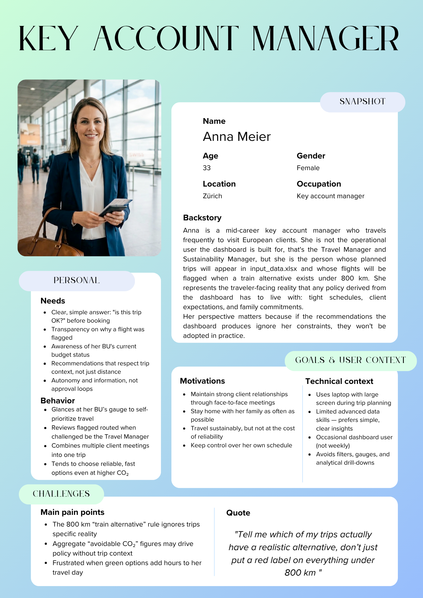

# Project Charta

---

## Context and Scope

The Carbon Gatekeeper Dashboard is an interactive analytic decision-support tool designed to manage and reduce CO₂ emissions from business travel by linking travel lists directly to carbon budgets. Moving beyond retrospective reporting, the dashboard provides tactical, real-time, data-driven guidance by analyzing planned itineraries. The project is designed to answer core questions for organizational management:

> *"What is the current CO₂ budget status and compliance across all Business Units (BUs)?"*
>
> *"Which specific routes in our planned travel have viable, lower-carbon alternatives based on historical data?"*
>
> *"How much CO₂ can we save by actively shifting to these recommended transport modes?"*

A central component is the **BU Budget Monitor**, which uses a gauge system and bar charts to compare accumulated emissions with annual CO₂ budgets, classifying units as under budget, approaching the limit, or over budget. The dashboard operates by taking a historical travel data file (to establish route averages and budgets) and comparing it against an uploaded list of planned trips. It automatically scans the planned entries to highlight specific routes where sustainable alternatives—such as train, bus, or rental car—exist.

By comparing these options, the tool quantifies the "avoidable CO₂" for those specific trips to make reduction opportunities immediately actionable. A key feature is the **scenario optimization toggle**, which allows users to "Apply alternatives." This dynamically shifts applicable flights to lower-CO₂ modes and recalculates the entire dashboard—including the budget gauges—to show the projected savings. The final product will be published as a web-based prototype via Streamlit, ensuring stakeholders can access the tool without additional software.

---

## Project Objectives and Success Criteria

The primary objective of this project is to deliver the "Carbon Gatekeeper" Dashboard, a functional prototype that moves the organization from retrospective reporting to active, point-of-planning travel management. Specifically, the dashboard enables stakeholders to answer and act on:

- **Budget Status & Comparison** — Visualizing the total CO₂ emissions versus the allocated budget and identifying exactly which Business Units are driving overruns.
- **Impact Comparison** — Quantifying the "avoidable CO₂" for specific routes by matching planned flights against historical greener alternatives.
- **Actionable Guidance** — Providing an "Optimised Scenario" that instantly applies mode shifts and visualizes the updated budget compliance.

### Success Criteria

**Qualitative Objectives**

- **Actionability** — The tool automatically identifies quick reduction levers by scanning user-provided trip lists and summarizing routes with the largest aggregate saving potential.
- **Transparency** — The dashboard provides a clear, hierarchical view of emissions, allowing users to effortlessly distinguish performance between Business Units.
- **Accessibility** — Stakeholders can access the tool directly through a web browser via a Streamlit deployment.

**Quantitative Metrics**

- **Data Accuracy** — 100% of calculations utilize specific CO₂ metrics (e.g., CO2e RFI2.7 or RFI2) to ensure high-fidelity environmental impact reporting.
- **Feature Integration** — The prototype must successfully integrate four core narrative sections: Overview KPIs, BU Performance (Gauges & Bars), Geographic distribution, and Reduction levers into a single interface.
- **Comparative Visibility** — For every route identified as having an alternative, the dashboard must clearly display the average flight CO₂, the alternative CO₂, and the total saving potential.

### Out of Scope

- **Predictive Analytics** — Forecasting future travel demand or long-term CO₂ trajectories
- **Full Footprint Accounting** — Inclusion of emissions outside of business travel
- **Automated Enforcement** — The tool provides recommendations and status alerts but does not physically block external booking transactions

---

## Stakeholder Analysis

### Sustainability Manager
> *"Numbers don't lie, neither does our planet"*

| | |
|---|---|
| **Role** | Responsible for company-wide monitoring of CO₂ emissions and achieving sustainability goals. This role operates across departments and does not focus on a single department but rather considers the entire company. The sustainability manager prepares reports for senior management and communicates progress to external stakeholders such as investors or regulatory agencies. |
| **Goal** | Monitor corporate travel emissions, identify savings, and track progress against the CO₂ budget. |
| **Dashboard interest** | **Very High.** As the primary user, they need to answer one question at any given moment: are we within budget, and if not, why? This tool replaces manual evaluations and is critical for their sustainability reporting. |

---

### Travel Manager
> *"Every trip planned, every policy enforced"*

| | |
|---|---|
| **Role** | Responsible for the operational coordination of all business travel within the company. The Travel Manager manages framework agreements with airlines, hotels, and rail carriers, and approves or denies travel requests. They are the first to notice when travel patterns get out of hand and act before they escalate, whether in terms of costs or emission. |
| **Goal** | Oversee all trip requests/approvals, identify policy violations, and actively promote sustainable travel alternatives. |
| **Dashboard interest** | **Very High.** This is a daily operational tool used to filter by transport mode, destination and department. The transport mode comparison is a core feature for this role. Spotting trips where a alternative connection was available, but a flight was booked anyway is exactly the policy violation the Travel Manger needs to act on. |

---

### Finance / Controlling
> *"No budget, no ticket"*

| | |
|---|---|
| **Role** | Responsible for monitoring all travel-related expenses and ensuring that budgets are adhered to across the company. The Finance team tracks spending across all departments and must flag deviations early before they become a budget problem. As business travel can represent a significant cost factor, they need clear visibility into where money is being spent, by whom, and for what purpose. |
| **Goal** | Understand cost distribution by department and travel purpose and ensure that travel expenditures remain within planned budget limits. |
| **Dashboard interest** | **Medium.** Finance focuses on cost-related KPIs, total spend, cost per trip, cost per department and cost per transport mode. CO₂ data is secondary unless emission-related fees become budget-relevant. The dashboard's value lies in consolidating travel costs in one place, without manual data pulls from separate systems. |

---

### Management / Corporate
> *"Big picture, no noise"*

| | |
|---|---|
| **Role** | Senior decision-makers with overall responsibility for the company's strategic direction, including sustainability commitments and cost targets. Management sets the overarching CO₂ reduction goals and travel budget thresholds, and is accountable to external stakeholders such as investors, regulators, or board members. They do not engage with individual trip data or operational details. Their view is exclusively top-down. |
| **Goal** | Get a fast, reliable overview of whether the company is on track to meet its sustainability and cost targets and have a data-driven basis to initiate strategic corrections if needed. |
| **Dashboard interest** | **High.** Management needs a clean summary view. Current CO₂ budget consumption, overall spend, and trend direction. The transport mode comparison feature is particularly relevant here, as it supports strategic decisions like introducing mandatory rail travel policies below a certain distance threshold. Detailed filters or raw data views are not relevant for this group. They need clear indicators, not analysis tools. |

{ width=70% }

---

## User Analysis

The following personas represent key user groups of the dashboard. 
They were developed based on literature and domain-specific sources to reflect 
different perspectives on business travel and CO₂ management within the company.

### Persona 1: Daniel Schmid
{ width=70% }

### Persona 2: Anna Meier
{ width=70% }

### Sources

#### Daniel Schmid
- [Sustainability Management in Companies: From Idea to Practice](https://fis.leuphana.de/de/publications/nachhaltigkeitsmanagement-in-unternehmen-von-der-idee-zur-praxis-/)
- [Sustainable Mobility and Management Series 38](https://www.hs-koblenz.de/fileadmin/media/fb_wirtschaftswissenschaften/Forschung_Projekte/Publikationen/Schriftenreihe_38_Schueller_Mengen.pdf)
- [The Greenhouse Gas Protocol: A Corporate Accounting and Reporting Standard](https://ghgprotocol.org/sites/default/files/standards/ghg-protocol-revised.pdf)
- [McKinsey Global Energy Perspective: Our Insights](https://www.mckinsey.com/industries/energy-and-materials/our-insights/global-energy-perspective)

#### Anna Meier
- [Survey: The Preferences of Modern Business Travelers](https://www.tourism-review.com/survey-shows-the-preferences-of-business-travelers-news14693)
- [Face Value: Why Business Travel Surges Amid Virtual Meeting Fatigue](https://www.ere.net/articles/face-value-business-travel-surges-as-virtual-meeting-fatigue-sets-in)
- [Study: Business Travellers Facing Stress and Well-being Challenges](https://www.travelpress.com/study-finds-business-travellers-facing-stress-well-being-challenges/)

---

## Situation Assessment

### Available Resources

**Data**

The primary data source is a dataset of business travel records containing attributes such as transport mode, origin/destination IATA codes, distance, and CO₂ emissions calculated using RFI methodologies. The dashboard requires this historical reference file to extract BU budgets and establish baseline route averages.

**Personnel**

The project is carried out by a student team of four members with complementary roles covering project coordination, data analysis and preprocessing, dashboard development and user analysis. All members contribute collaboratively across tasks.

**Tools**

- Python
- Pandas for data manipulation
- Plotly for interactive, standardized visualizations
- Streamlit for interactive dashboard implementation
- GitHub repository for reproducibility and version control

**Infrastructure**

- GitHub repository as the central platform for code, documentation and version control
- GitHub Pages or Streamlit Cloud for web-based deployment of the dashboard prototype
- Local development environments across all team members

### Constraints

- Limited project time within the semester schedule
- No access to real-time booking systems or external travel APIs — the analysis is limited to the provided static dataset
- Reproducibility must be fully ensured via the GitHub repository, including data processing steps and visualization code

### Risks

- **Missing / inconsistent data fields** *(Medium likelihood, High impact)* — Early data audit and cleaning in the preparation phase
- **Time limitations for interactive features** *(High likelihood, Medium impact)* — Prioritise core features (budget monitor, train vs. plane) over secondary filters
- **Streamlit deployment issues** *(Low likelihood, Medium impact)* — Test deployment early, fall back to local demo if needed

---

## Visualization Concept

### Product Form

The product is an analytic dashboard tailored for tactical decision support. It supports quick assessment and detailed exploration, helping users monitor emissions per BU and evaluate travel mode optimizations.

### Visual Encodings

- **Highlight metrics (KPIs)** — Display Total CO₂ emissions, Budget utilization, Reduction potential, and the number of analyzed trips at the very top.
- **Gauges (Green, Yellow, Red)** — Show CO₂ usage per Business Unit as traffic light indicators (under, approaching, or over budget).
- **Bar Charts** — A horizontal bar chart directly comparing actual emissions versus the allocated budget target line for all BUs simultaneously.
- **Connection Map** — A geographic map (World, Europe, Americas, Asia) illustrating travel paths where line thickness scales with total CO₂ emissions and color encodes the transport mode.
- **Reduction Levers Table** — A dynamic summary table aggregating the top routes where sustainable alternatives exist, detailing the potential CO₂ savings.

### Interactivity
Users must upload a historical reference Excel file and can optionally upload a planned trips file in the sidebar. The dashboard updates dynamically based on these inputs. A central interaction is the "Apply alternatives" button, which shifts the dashboard state into an "optimised scenario," instantly reflecting the projected CO₂ savings across all KPI cards and BU gauges.

### Narrative and Annotation

The layout flows from **overview** (budget status) → **insights** (modal shift potential) → **action** (trip evaluation). Labels, short explanatory texts, and recommendation messages guide interpretation.

### Target Medium and Integration

Designed as a web-based dashboard for the company intranet, ensuring accessibility during travel planning and integration into existing workflows.

### Value

| Dimension | Description |
|---|---|
| **Cognitive** | Highlights patterns, differences, and trade-offs clearly |
| **Communicative** | Translates complex travel data into actionable, understandable insights |
| **Experiential** | Interactive, visually engaging design encourages trust, clarity, and adoption |

---

## Project Plan

The project is structured into four main phases: project understanding, data acquisition and exploration, visual encoding and design, and evaluation. The following Gantt chart provides an overview of the planned tasks and milestones.

```{mermaid}
%%| label: fig-project-plan
%%| fig-cap: Preliminary project plan for the Carbon Gatekeeper Dashboard.
gantt
    title Project Plan
    dateFormat YYYY-MM-DD
    axisFormat %Y-%m-%d
    tickInterval 16day

    section Project Understanding
        Context analysis             :a1, 2026-03-12, 3d
        User analysis                :a2, 2026-03-15, 4d
        Situation assessment         :a3, 2026-03-19, 2d
        Objectives & concept         :a4, 2026-03-21, 2d
        Project charta               :milestone, m1, 2026-03-20, 1d

    section Data Acquisition and Exploration
        Acquire data                 :b1, 2026-03-23, 5d
        EDA                          :b2, 2026-03-28, 7d
        Data report                  :milestone, m2, 2026-04-06, 1d

    section Visual Encoding and Design
        Core views                   :c1, 2026-04-07, 7d
        Dashboard prototype          :c2, 2026-04-15, 14d

    section Evaluation
        Documentation                :d1, 2026-04-30, 14d
        Draft presentation           :milestone, m3, 2026-05-18, 1d
        Final presentation           :d2, 2026-05-19, 7d
        Final revisions              :d3, 2026-05-27, 4d
        Project submission           :milestone, m4, 2026-06-01, 1d
```

---

## Roles and Contact Details

| Name | Role | Tasks | Contact |
|---|---|---|---|
| **Michelle Linares M.** | Project coordination, visualization design | Project planning and coordination, development of the visualization concept, dashboard design and documentation | linarmic@students.zhaw.ch |
| **Domenik Bächler** | Data analysis and processing | Data cleaning and preprocessing, exploratory data analysis, calculation of CO₂ metrics and preparation of the data report | baechdom@students.zhaw.ch |
| **Dario Filippone** | Dashboard development | Implementation of the interactive dashboard, integration of visualizations, development of filtering and interaction features | filipda1@students.zhaw.ch |
| **Ajna Binaki** | User analysis and evaluation | Stakeholder and user analysis, definition of personas, evaluation of the visualization and preparation of presentation materials | binakajn@students.zhaw.ch |
