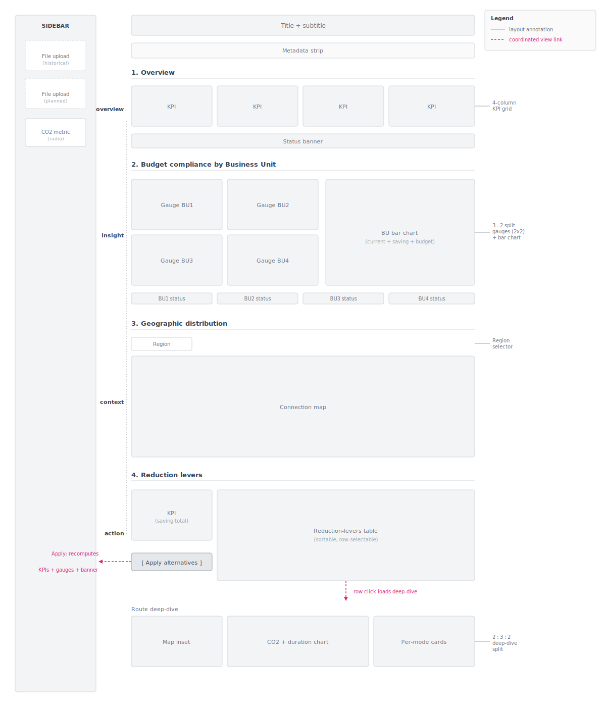

# Visualization Design Report
This report documents the visual encoding and design decisions made during the development of the visualization product. It translates the visualization concept outlined in the [Project Charta](project_charta.qmd) into concrete design specifications and documents the resulting prototype(s).

## Design Overview
The visualization concept frames the Carbon Gatekeeper Dashboard as an analytic, web-based decision-support tool that links planned business travel to annual CO₂ budgets. It is built to answer three questions: the current budget status across Business Units, the planned routes with viable lower-carbon alternatives, and the CO₂ that can be saved by shifting transport modes.

The concept specifies four coordinated views (Overview KPIs, BU Performance with gauges and bar chart, Geographic distribution as a connection map, and Reduction levers as an alternatives table) arranged in an overview → insight → action narrative. The central interaction is an "Apply alternatives" toggle that recomputes the dashboard under an optimized scenario. The design is driven by three qualitative objectives, actionability, transparency, and accessibility, and serves four user roles: Sustainability Manager, Travel Manager, Finance, and Management.

**Refinements during the design process.** The implemented prototype preserves the concept, with three refinements. The BU bar chart was redesigned as a dual-encoding view, where each bar shows current CO₂ (solid) and additional saving potential (hatched) against the budget (dotted reference line), answering three questions in a single chart. A route-level deep-dive was added below the reduction-levers table, so that clicking a route opens a CO₂-vs-duration comparison across all transport modes and turns the table from a ranked list into an evidence-based recommendation view for the Travel Manager. Finally, status was verbalised alongside the gauges through plain-language banners such as "BU1 on track (57% used)", serving the Management persona's need for a fast, interpretation-free read.

## Data-to-Visual Mapping
The dashboard draws on two processed tables produced from the source files: a historical reference table and a planned-trips table. The CO₂ metric used for all calculations is user-selectable between CO₂e RFI2 (t) and CO₂e RFI2.7 (t), so the dashboard adapts to whichever radiative-forcing standard the organisation reports against. The variables most frequently mapped are origin and destination (IATA codes), mode, distance, business_unit, trip_count, and co2_kg.

The mapping below follows the order in which the views appear in the dashboard.

*Table 1: Data-to-visual mapping overview.*

| View / Chart | Data variables | Mark type | Visual channels | Scale |
|---|---|---|---|---|
| Overview KPI cards | total_co2, budget_total, reduction_potential, trip_count | numeric label | colour hue (green = under budget / red = over), text size (value vs. label hierarchy) | quantitative, categorical status |
| Status banner | budget_utilisation (%) | text label + background fill | colour hue (green / yellow / red) | categorical (traffic-light) |
| BU gauges (one per BU) | actual_co2, bu_budget | arc segment | angular position (CO₂ value), colour hue (status zone), zone segments | linear (0 → max), categorical zone |
| BU bar chart | business_unit, actual_co2, saving_potential, bu_budget | stacked horizontal bar + dotted reference line | vertical position (business unit), length (CO₂), texture (solid = with alternatives / hatched = current), colour hue (BU identity) | categorical (BU), linear (tonnes) |
| Geographic distribution map | origin, destination (coordinates), mode, route_co2 | great-circle line + point | spatial position (lat/lon), line width (CO₂), colour hue (mode) | geographic (natural earth / mercator), linear (width), categorical (mode) |
| Reduction-levers table | origin, destination, alternative_mode, flight_count, avg_flight_co2, avg_alt_co2, saving_t, saving_pct | table row + selectable | vertical position (rank by saving), colour hue (green saving potential) | categorical, linear |
| Route deep-dive (map inset) | origin, destination, mode polylines, duration | line + label | spatial position (lat/lon), colour hue (mode), text (duration label) | geographic, categorical |
| Route deep-dive (combo chart) | mode, co2_per_pax, duration | bar + diamond marker | horizontal position (mode), bar height (CO₂, left y-axis), marker height (duration, right y-axis), colour hue (mode) | categorical, dual linear |
| Per-mode comparison cards | mode, co2_per_pax, duration, delta_vs_flight | numeric label + coloured side-bar | vertical position (rank by CO₂), colour hue (mode), arrow symbol (▼/▲ vs. flight) | categorical, quantitative |

### Colour design
Two semantic palettes run through the dashboard. A traffic-light palette (green / yellow / red) encodes budget status across the gauge zones, the status banner, and the saving column in the reduction-levers table, so colour carries information independent of legend lookup. A categorical mode palette (green = train, blue = bus, red = flight, orange = rental car) is reused across the connection map, the deep-dive chart, the polyline inset, and the per-mode cards, letting users transfer meaning across views without re-reading legends. Red is reserved for flights because they are also the carbon-heavy default the dashboard is designed to challenge, so the semantic and categorical encodings reinforce each other. The four Business Units use a separate categorical palette (blue, purple, teal, magenta) that is orthogonal to the mode palette, and the green/red traffic-light is reinforced by position and explicit text labels to remain readable under common colour-vision deficiencies.

## Layout and Composition
The dashboard is built as a single-page Streamlit application with a fixed-width main canvas (max 1400 px) and a persistent left sidebar for inputs. Views are stacked vertically into four thematic sections (Overview, Budget compliance by Business Unit, Geographic distribution, Reduction levers), each separated by a thin divider and a section title. The layout follows the *overview → insight → action* narrative defined in the design concept: KPI cards at the top, BU breakdown in the middle, geographic context after, and the actionable reduction-levers table with its deep-dive at the bottom.

### Spatial arrangement
A vertical scrollable layout was chosen over a multi-tab or grid dashboard because each section answers a different question and the user reads them in order rather than comparing them side by side. Within each section a horizontal grid groups related views: the four KPI cards in a 4-column row, the four BU gauges in a 2×2 grid paired with the BU bar chart on the right (3:2 split), and the route deep-dive in a 2:3:2 split of map, combo chart, and per-mode cards. A metadata strip above the first section states source file, period, trip count, scenario, reference, and method, applying the lecture guideline of stating provenance up front.

### Coordination between views
Several views are coordinated rather than independent: row selection in the reduction-levers table loads the deep-dive panel below, the **Apply alternatives** button recomputes every dependent view simultaneously so the user never sees a mixed scenario state, and the region selector filters the geographic view in place. The mechanics of these interactions are documented in section 1.4. As a layout consequence, the BU bar chart additionally shows the saving potential permanently as a hatched segment, keeping the *as-planned* and *with-alternatives* states visually comparable even before the scenario is applied.

### Hierarchy and navigation
Navigation is implicit rather than menu-driven: the user scrolls through the four sections in order. The hierarchy of detail goes from aggregated (KPI cards, status banner) to BU-level (gauges and bar) to spatial (connection map) to route-level (table and deep-dive), so each section adds one layer of granularity. Raw row-level data is available through a collapsed *Detail data and export* expander at the bottom so it does not compete for attention with the main views.

**Responsive design.** The Streamlit column system reflows column groups when the viewport narrows, so the 4-column KPI row, the 3:2 gauge/bar split, and the 2:3:2 deep-dive split collapse into stacked rows on smaller screens. Plotly figures use `use_container_width=True` to fill the available column, and the gauges scale by row rather than absolute width. The sidebar collapses on narrow viewports, leaving the main canvas full-width. The layout is optimised for desktop use (the primary working context for the Sustainability and Travel Manager personas) and remains readable on tablets, but is not designed for mobile-first use.

{#fig-wireframe width=100%}

## Interaction Design
The dashboard is intentionally low on controls: every interaction either changes which data is loaded, narrows a view, opens a detailed comparison, or switches between the *as-planned* and *optimised* scenario.

### Interaction techniques
**File upload (selection):** the sidebar accepts a required historical reference file and an optional planned-trips file. The historical file drives route averages and budgets; the planned-trips file defines the scenario being analysed. This is the entry point for all subsequent views.

**CO₂ metric switch (filtering):** a selector toggles between CO₂e RFI2 and CO₂e RFI2.7, propagating through every calculation so the entire dashboard re-renders against the chosen accounting standard. Supports the Sustainability Manager's reporting needs, where the applicable standard varies by audience.

**Region selector (filtering):** a dropdown above the connection map re-projects the geography between World, Europe, Americas, and Asia views. Supports the Travel Manager's task of inspecting concentration patterns at the relevant scale.

**Row selection in the reduction-levers table (drill-down):** clicking a row loads that origin/destination into the route deep-dive below, populating the map inset, combo chart, and per-mode cards. This is the most cognitively important interaction: it converts a ranked saving opportunity into a comparable, defensible recommendation — exactly what the Travel Manager needs to justify a mode-shift decision.

**Apply alternatives (scenario toggle):** the primary button below the table switches the dashboard into the optimised scenario, recomputing the KPIs, headline banner, BU gauges, BU bar chart, and geographic map under the assumption that every flight with a greener alternative has been switched. A reset button restores the as-planned scenario. This single interaction operationalises the *action* objective of the project.

**Hover (details-on-demand):** every chart exposes hover tooltips with per-route, per-BU, or per-mode detail, supporting exploratory inspection without leaving the view.

**Input modalities.** All interactions are mouse-driven: file pickers, dropdowns, radio buttons, table-row clicks, button clicks, and hover. Streamlit's components are keyboard-accessible by default. There are no custom shortcuts, search fields, or touch gestures — the dashboard is built for a desktop browser.

### State management
Streamlit's session state persists two things across reruns: the active scenario (`as_planned` / `optimised`) and the selected deep-dive route. Pressing **Apply alternatives** writes `scenario = optimised`; the reset button clears it. Table-row selection writes the route into session state before the deep-dive widgets render, so the deep-dive updates within the same interaction without a second click. File uploads are cached so re-runs do not re-parse the Excel files.

**Feedback and transitions.** Feedback is immediate and visual rather than animated. Switching to the optimised scenario triggers a green banner stating the number of flights shifted and the tonnes saved, and all dependent views re-render with the new values. Row selection highlights the active row and reveals the deep-dive section below with a header that names the route and flags whether each mode's value is historical or distance-estimated. Status banners across the dashboard use the same green / yellow / red logic so that interaction feedback never introduces a new visual language.

### Contribution to user value
Cognitively, the row-click drill-down and hover tooltips reduce the effort of comparing alternatives by keeping all relevant information on one screen. Communicatively, the **Apply alternatives** toggle translates a long list of route-level savings into a single, dashboard-wide answer to *what would change if we acted on this?* — the question Management needs answered without inspecting individual trips. Experientially, the combination of immediate feedback, plain-language banners, and the easily resettable scenario gives the user confidence to explore the optimised view without fear of losing their place.

## Visual Style and Aesthetics
The dashboard follows a restrained visual language: neutral greys for structure, semantic colours only where they carry meaning, and a single typographic family throughout.

### Typography
Inter (with Arial as fallback) is used across all components, ensuring no font mismatch between Streamlit and Plotly. Four hierarchy levels are used: page title (1.65 rem, 600 weight), section titles (1.05 rem, 600, with a thin bottom border), KPI values (1.8 rem, 700), and body / hint text (0.82–0.95 rem). KPI labels are uppercase at 0.78 rem with letter-spacing to read as identifiers rather than headlines.

### Colour palette
Three palettes operate independently. The **neutral palette** carries structure: ink `#1F2937`, muted `#6B7280`, border `#E5E7EB`, soft background `#F9FAFB`. The **semantic status palette** carries budget compliance: ok `#10B981`, warn `#F59E0B`, bad `#EF4444`. The **categorical palettes** distinguish two independent dimensions — Business Units (`#2563EB`, `#7C3AED`, `#0891B2`, `#DB2777`) and transport modes (train `#10B981`, bus `#3B82F6`, flight `#EF4444`, rental car `#F59E0B`). Red is deliberately shared between *over budget* and *flight*, since flights are the carbon-heavy default the dashboard is built to challenge.

**Spacing and alignment.** The main canvas is capped at 1400 px. Streamlit's column system provides the horizontal grid; section titles have generous top margins to separate thematic blocks without hard rules, and chart gridlines are kept light (`#E5E7EB`) to avoid visual noise.

**Branding.** The prototype does not integrate an organisational identity. A production version would substitute the BU palette with the organisation's brand colours and add a logo, without altering the rest of the design system.

### Accessibility
Colour is never the sole carrier of meaning: every status is accompanied by an explicit text label, the BU bar chart uses a hatched texture in addition to colour, and legends are present on every chart. Contrast ratios for the main text/background combinations exceed the WCAG AA 4.5:1 threshold. The categorical palettes were chosen to remain distinguishable under common colour-vision deficiencies.

## Prototype Description
**Fidelity.** The prototype is **high-fidelity**: a fully interactive web implementation rendered from real data, with all four thematic sections, all interactions (scenario toggle, drill-down, region selector, hover), and the responsive Streamlit layout in place.

**Screenshots and link.** The prototype is available at: <https://podsv-fs26-ad24.github.io/ad24-7-fancyproject/> *(replace with the actual Streamlit Cloud URL if deployed elsewhere)*.

### Technology stack
- **Python 3** as the implementation language
- **Streamlit** for the web app framework and layout
- **Plotly** (`graph_objects`) for all interactive charts and the connection map
- **pandas** for data loading, route aggregation, and scenario computation
- **openpyxl** for Excel I/O
- **NumPy** for distance calculations (haversine, emission-factor fallback)

**Code and version control.** The source code is maintained in the GitHub repository <https://github.com/podsv-fs26-ad24/ad24-7-fancyproject>, on the `main` branch. The version corresponding to this report is tagged `viz-design-report`.

## Design Rationale and Iterations
### Design alternatives
Four alternatives were considered and discarded:

- **Multi-tab layout** instead of a single scrollable page — rejected because tabs let users jump to the action table without first seeing the budget context that makes a saving meaningful.
- **Four separate regional maps** (as proposed in the Charta) — replaced by a single map with a region dropdown to avoid visual switching and keep the geographic section from dominating the page.
- **Side-by-side before/after bar charts** — replaced by the dual-encoding bar (solid current + hatched saving + dotted budget) so the saving potential is readable without mental subtraction.
- **Filter-heavy sidebar** (mode, BU, date, destination) — abandoned because it pushed the dashboard toward an analysis sandbox and conflicted with Management's stated need for "clear indicators, not analysis tools."

### Design rationale
Each project objective maps onto a specific element: **actionability** through the row-click drill-down and the **Apply alternatives** toggle, **transparency** through the dual-encoded BU bar chart and verbal status banners, **accessibility** through the web deployment and plain-language phrasing. In terms of value, the layout and position-based encodings carry the **cognitive** load (high-accuracy magnitude comparisons on one screen). Plain-language banners carry the **communicative** value by stating a verdict that does not require chart literacy. The easily resettable scenario toggle and immediate cross-view feedback carry the **experiential** value, encouraging exploration without fear of losing context.

**Iteration history.** Three changes during implementation are worth noting. The BU bar chart was redesigned from a single-value bar into the current dual-encoding bar, so the saving potential is visible without first pressing **Apply alternatives**. The route-level deep-dive was added below the reduction-levers table after early reviews indicated that the table alone did not justify a mode-shift recommendation. Plain-language status banners were added alongside the gauges to serve the Management persona's need for clear indicators rather than colour interpretation.

## Conclusions and Next Steps
Summarise the key design decisions and their expected impact on the project objectives. Identify open questions, known limitations of the current prototype and topics to be addressed in the [Evaluation](evaluation.qmd) phase.
